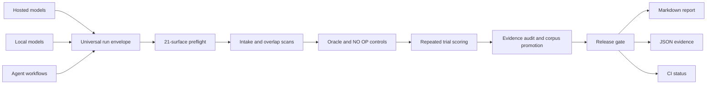

# Proofrail Architecture

Proofrail separates model execution from evaluation. Any hosted model, local model, or agent framework can produce the common run envelope; the same review engine then applies version-controlled tests and gates.

## Universal run envelope

The envelope preserves provider and model identity while normalizing the evidence needed for comparison:

- Primary text or structured output
- Conversation messages
- Tool calls, arguments, results, and statuses
- Agent trace events
- Artifact references and metadata
- Human or model-review scores
- Latency and cost metadata

## Evaluation layers

**Deterministic evaluators** cover exact content, regular expressions, structured JSON, required tool use, tool reliability, trace completeness, and prohibited behavior.

**Calibrated review scores** allow human reviewers or model judges to score subjective criteria while preserving criterion-level evidence.

**Custom evaluators** implement domain rules without changing the core engine. These plug-ins are trusted code and belong inside the normal code-review boundary.

## Release semantics

A candidate can be released only when:

1. The evaluation specification and run envelopes are valid.
2. The task does not exceed the configured overlap threshold.
3. The oracle passes and the negative control fails.
4. The required proportion of repeated trials passes.

The report preserves individual failures even when the aggregate release gate passes.
